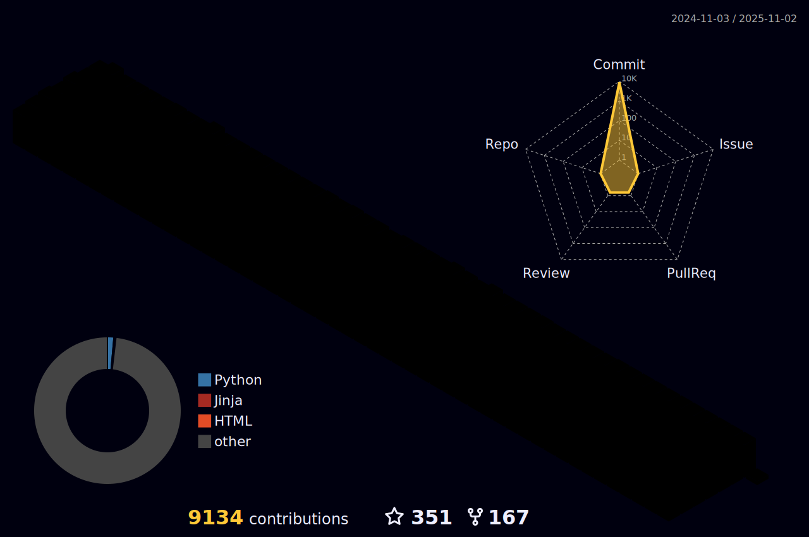

### 氦, 👋 !

<div align="center">

<div align="center"></div>
<div align="center"></div>


<h3>📝 Visit my blog https://github.icu</h3>

[](https://visitor-badge.laobi.icu/badge?page_id=leif160519)
[](https://github-readme-stats-git-masterorgs-github-readme-stats-team.vercel.app/api?username=leif160519&include_orgs=true&hide_title=false&hide_border=true&show_icons=true&include_all_commits=true&line_height=20&bg_color=0,EC6C6C,FFD479,FFFC79,73FA79&theme=tokyonight&locale=en)[](https://github.com/leif160519/centos-script)
[](https://github.com/leif160519?tab=followers)
[](https://github.icu)


</div>

***

### 💻 Stats
<details>
<summary>Click to expand ...</summary>

<div align="center">


<a href="https://github.com/leif160519"></a>

[](https://github-readme-stats-git-masterorgs-github-readme-stats-team.vercel.app/api?username=leif160519&include_orgs=true&hide_title=false&hide_border=true&show_icons=true&include_all_commits=true&line_height=20&theme=tokyonight&locale=en)[](https://github-readme-stats.vercel.app/api/top-langs/?username=leif160519&hide_title=false&hide=c&hide_border=true&layout=compact&theme=tokyonight&locale=en)

<a href="https://github.com/ryo-ma/github-profile-trophy"></a>

[](https://raw.githubusercontent.com/leif160519/leif160519/master/assets/github-contribution-grid-snake.svg)
[](https://raw.githubusercontent.com/leif160519/leif160519/master/profile-3d-contrib/profile-night-rainbow.svg)

</div>

</details>

***

### 🏊 Blogs posts
<!-- BLOG-POST-LIST:START -->
- 👹 [如何通过云服务器内网穿透访问家庭Linux服务器](https://github.icu/articles/2023/06/16/1686899454011.html) 

- 🦆 [年度计划](https://github.icu/my-plan) 

- 💡 [如何自签发免费通配符域名证书并实现自动化----Let&#39;s Encrypt](https://github.icu/articles/2023/06/10/1686364528354.html) 

- 🔭 [打赏](https://github.icu/reward) 

- 👍 [Linux使用mutt发邮件](https://github.icu/articles/2021/06/02/1622615771782.html) 

- 🫣 [Squid设置用户名密码](https://github.icu/articles/2021/11/27/1638001156905.html) 
<!-- BLOG-POST-LIST:END -->

***

### 📊 Weekly development breakdown
<!--START_SECTION:waka-->

```txt
YAML          24 mins         ████████▓░░░░░░░░░░░░░░░░   35.18 %
Other         20 mins         ███████▒░░░░░░░░░░░░░░░░░   29.49 %
mailaliases   14 mins         █████▒░░░░░░░░░░░░░░░░░░░   21.38 %
Markdown      6 mins          ██▒░░░░░░░░░░░░░░░░░░░░░░   08.75 %
Bash          2 mins          █░░░░░░░░░░░░░░░░░░░░░░░░   03.53 %
```

<!--END_SECTION:waka-->

***

### 🧰 Languages and Tools
<p align="left"> <a href="https://aws.amazon.com" target="_blank" rel="noreferrer">  </a> <a href="https://azure.microsoft.com/en-in/" target="_blank" rel="noreferrer">  </a> <a href="https://www.gnu.org/software/bash/" target="_blank" rel="noreferrer">  </a> <a href="https://www.djangoproject.com/" target="_blank" rel="noreferrer">  </a> <a href="https://www.docker.com/" target="_blank" rel="noreferrer">  </a> <a href="https://www.elastic.co" target="_blank" rel="noreferrer">  </a> <a href="https://flask.palletsprojects.com/" target="_blank" rel="noreferrer">  </a> <a href="https://git-scm.com/" target="_blank" rel="noreferrer">  </a> <a href="https://grafana.com" target="_blank" rel="noreferrer">  </a> <a href="hexo.io/" target="_blank" rel="noreferrer">  </a> <a href="https://www.w3.org/html/" target="_blank" rel="noreferrer">  </a> <a href="https://gohugo.io/" target="_blank" rel="noreferrer">  </a> <a href="https://www.java.com" target="_blank" rel="noreferrer">  </a> <a href="https://www.jenkins.io" target="_blank" rel="noreferrer">  </a> <a href="https://kafka.apache.org/" target="_blank" rel="noreferrer">  </a> <a href="https://www.elastic.co/kibana" target="_blank" rel="noreferrer">  </a> <a href="https://kubernetes.io" target="_blank" rel="noreferrer">  </a> <a href="https://www.linux.org/" target="_blank" rel="noreferrer">  </a> <a href="https://mariadb.org/" target="_blank" rel="noreferrer">  </a> <a href="https://www.mongodb.com/" target="_blank" rel="noreferrer">  </a> <a href="https://www.mysql.com/" target="_blank" rel="noreferrer">  </a> <a href="https://www.nginx.com" target="_blank" rel="noreferrer">  </a> <a href="https://nodejs.org" target="_blank" rel="noreferrer">  </a> <a href="https://openresty.org/" target="_blank" rel="noreferrer">  </a> <a href="https://www.oracle.com/" target="_blank" rel="noreferrer">  </a> <a href="https://www.photoshop.com/en" target="_blank" rel="noreferrer">  </a> <a href="https://www.postgresql.org" target="_blank" rel="noreferrer">  </a> <a href="https://postman.com" target="_blank" rel="noreferrer">  </a> <a href="https://www.python.org" target="_blank" rel="noreferrer">  </a> <a href="https://www.rabbitmq.com" target="_blank" rel="noreferrer">  </a> <a href="https://realm.io/" target="_blank" rel="noreferrer">  </a> <a href="https://redis.io" target="_blank" rel="noreferrer">  </a> <a href="https://www.sketch.com/" target="_blank" rel="noreferrer">  </a> <a href="https://spring.io/" target="_blank" rel="noreferrer">  </a> <a href="https://www.sqlite.org/" target="_blank" rel="noreferrer">  </a> </p>

***

### :zap: Recent Activity
<!--START_SECTION:activity-->
1. ❗ Opened issue [#134](https://github.com/starsliao/Prometheus/issues/134) in [starsliao/Prometheus](https://github.com/starsliao/Prometheus)
<!--END_SECTION:activity-->

***

### 🔥 More Projects
<details>
<summary>Click to expand ...</summary>

|Project|Remark|
|-------|------|
|[centos-script][1]|centos下工具安装脚本，包含基础环境配置，Gitlab、Docker、LDAP、MongoDB、MySQL、RabbitMQ、Supervisor、Node、Python、zsh、rar、zabbix、k8s、prometheus、grafana等|
|[ansible-linux][2]|使用ansible批量配置Linux，支持Debian和RedHat，包含常用软件的安装，系统配置等，支持自动化搭建prometheus监控，飞书告警，consul自动发现，loki日志采集等功能|
|[ubuntu-script][3]|ubuntu下工具安装脚本，包含基础环境配置，nfs、samba、Docker、k8s等|
|[docker-script][4]|Docker环境下安装各种软件的脚本，包含jenkins，sonarqube，jumpserver，nexus等|
|[ansible-install-k8s][5]|使用Ansible自动化安装kubernetes集群相关组件|
|[python-alidns][6]|使用python脚本新增，删除，更新阿里云dns解析记录|
|[k8s-deploy][7]|kubernetes常用工具一键安装脚本|
|[certbot-hooks-aliyun][9]|certbot签发脚本时自动添加阿里云dns解析|
|[Books][8]|运维相关的书籍和资料-电子版|

</details>


[1]: https://github.com/leif160519/centos-script
[2]: https://github.com/leif160519/ansible-linux
[3]: https://github.com/leif160519/ubuntu-script
[4]: https://github.com/leif160519/docker-script
[5]: https://github.com/leif160519/ansible-install-k8s
[6]: https://github.com/leif160519/python-alidns
[7]: https://github.com/leif160519/k8s-deploy
[8]: https://github.com/leif160519/Books
[9]: https://github.com/leif160519/certbot-hooks-aliyun
